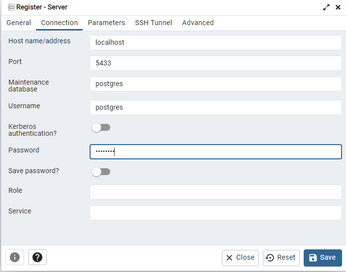
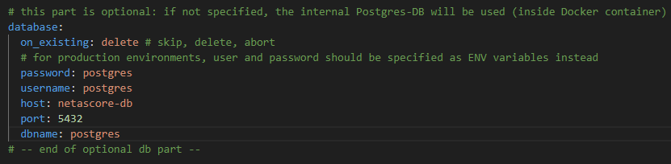

# Advanced Docker customisation

In addition to the [running NetAScore in a Docker environment](How-to-run-the-project-in-a-Docker-environment), there are a lot of options for customisation when using Docker with NetAScore:

```{contents}
:local:
```
# Build the Docker image from source

The easiest way to build and launch NetAScore is by using docker compose. The `docker-compose.yml` inside the main code directory is configured accordingly. Therefore, the only command you need to execute should be:

`docker compose build`

Then, once you are sure that all input datasets, settings and mode profile files are properly placed inside the `data` subdirectory, execute NetAScore:

`docker compose run netascore data/<your_settings_file>.yml`

<!-- clarify why theís is useful and needed, add more detail, check up-to-dateness -->

## The manual, stepwise approach

You can build the Docker image yourself from source using the following command from within the main code directory:

`docker build -t netascore .`

This builds a local docker image named `netascore`.

To manually create a network for communication between NetAScore and the PostgreSQL database running in Docker execute the following (required only once per computer):

`docker network create netascore-net`

Then, to run the workflow, first start the PostgreSQL database and attach it to the network:

```bash
docker run --name netascore-db --network=netascore-net \
        -e POSTGRES_PASSWORD=postgres -d postgis/postgis:13-3.2
```

```bash
# Map TCP port 5432 in the container to port 5433 on the Docker host:
docker run --name netascore-db --network=netascore-net -p 5433:5432 \
        -e POSTGRES_PASSWORD=postgres -d postgis/postgis:13-3.2
```

Make sure that the database connection in your `settings.yml` is set up to use the Docker network:

```yaml
database:
    host: netascore-db
    port: 5432
    dbname: postgres
    username: postgres
    password: postgres
```

Make sure that you have all necessary geofiles, settings and mode profile files in the `data` subdirectory, because this directory is mounted into the netascore container:

```bash
# linux and mac:
docker run -i -t --network=netascore-net \
        -v $(pwd)/data:/usr/src/netascore/data netascore data/settings.yml
```

```shell
# windows:
docker run -i -t --network=netascore-net \
        -v %cd%/data:/usr/src/netascore/data netascore data/settings.yml
```


# Advanced configuration

## Only the database runs in docker

If the database runs in docker, then you have to configure your database to accept connections from the local machine:

```bash
docker run --name netascore-db --network=netascore-net -p 5432:5432 \
        -e POSTGRES_PASSWORD=postgres -d postgis/postgis:13-3.2
```

Your `database` section in the settings file should point to the local port which is mapped to the database on localhost:

```yaml
database:
  host: localhost
  port: 5432
  dbname: postgres
  username: postgres
  password: postgres
```

Now you can use the python script as described in the [README.md](https://github.com/plus-mobilitylab/netascore/blob/main/README.md).

## Only the script runs in docker

If the script runs inside the docker container, it needs access to the database outside of the docker ecosystem. If the external database runs on another host, provide the necessary connection information in the `database` section. If you have the database running on your local system, then the host needs the IP address or hostname of the local system. Please note that `127.0.0.1` or `localhost` will not work, because it would try to connect to the container's localhost. If you are unable to obtain the ip of your
machine, or you cannot establish a connection, use `gateway.docker.internal`* as the host, e.g.:

```yaml
database:
  host: gateway.docker.internal
  port: 5432
  dbname: postgres
  username: postgres
  password: postgres
```

    * If this does not work out for you, you can also try using `host.docker.internal` as the host.

## Access the docker database through a local PostgreSQL-Instance:
If you want to see or access the data stored in the Docker-DB-Instance you can do so using Postgres or PGAdmin.

First run NetAScore through docker once, to start up the processes neccessary. Afterwards check if the run was successful and if the Docker Container is active.

Continue in PGAdmin and register a new server (Servers>Register>Server...). 
Name your instance `netascore-db` and implement the following settings in the `Connection-tab`:
- set the host to: ***localhost***
- set the port to 5433
- the password and the user both to postgres
- save



Also adapt your settings-file in the database section accordingly:



The database should now be visible and contain the data of the last case you ran.

<!-- TODO: explain datasets visible in DB-->

If you want to use a different password or username and another port, this can be configured in your `docker_compose.yml`-file.


The `port`-Section specifies the internal mapping between the port in the Docker container and the one of the local DB-Instance and the `environment`-settings spe3cify the credentials for the Docker-DB.

## Troubleshooting and performance improvement

### Performance when running NetAScore in Docker

When using NetAScore in a docker image on mac or windows, overall performance of the pipeline can be 3-5 times slower compared to executing NetAScore in local Python or in Docker on Linux. This is caused by slow docker volume mounts and might be an issue for computations on large input files. 
To resolve this issue, you can either execute the python script on your machine (outside Docker) or copy the files into a volume using the following steps:

```bash
docker volume create netascore-storage

docker create -t --network=netascore-net --name netascore-pipe \
        -v netascore-storage:/usr/src/netascore/data netascore data/settings.yml

docker cp data/. netascore-pipe:/usr/src/netascore/data

docker start netascore-pipe
```

To monitor the progress (logs), run:

```bash
docker logs -f netascore-pipe
```

This command will show the logs of the container and will follow the logs. You can stop the command with `ctrl+c`.

To copy the resulting files back to your local system, you can use the following command:

```bash
docker copy netascore-pipe:/usr/src/netascore/data/YOUR_RESULT_FILE1.gpkg .
docker copy netascore-pipe:/usr/src/netascore/data/YOUR_RESULT_FILE2.gpkg .
```

### Memory issues with large datasets

In case you experience errors when processing large datasets, please make sure that you have enough memory and disk space available. 
Furthermore, it might be necessary to dedicate more memory to the database container. This can be done by adding the following line to `docker-compose.yml` within the section `netascore-db` (adjust the amount of memory to your needs):

```yaml
shm_size: 2gb
```

Then, the `netascore-db`-section of `docker-compose.yml` should look like this:

```yaml
netascore-db:
    image: postgis/postgis:13-3.2
    shm_size: 2gb
    ports:
    - "5433:5432"
    environment:
    - POSTGRES_USER=postgres
    - POSTGRES_PASSWORD=postgres
    - POSTGRES_DB=postgres
    healthcheck:
      test: ["CMD-SHELL", "pg_isready", "-U", "postgres"]
      interval: 10s
      timeout: 20s
      retries: 120
```


## Overwrite `default.style` for OSM import to database

For importing OpenStreetMap data into the database, NetAScore uses [osm2pgsql](https://osm2pgsql.org/). Import settings for this commandline utility are provided in a `default.style` file. By default, NetAScore provides this file within its Docker container. In order to customize `default.style` settings you may perform the following steps:

- copy the file from this repository (`resources/default.style`)
- adapt the settings according to your needs
- mount the settings file into the docker container when running it

```bash
# linux and mac:
docker run -i -t --network=netascore-net \
        -v $(pwd)/default.style:/usr/src/netascore/resources/default.style \
        -v $(pwd)/data:/usr/src/netascore/data netascore data/settings.yml
```

```shell
# windows:
docker run -i -t --network=netascore-net \
        -v %cd%/default.style:/usr/src/netascore/resources/default.style \
        -v %cd%/data:/usr/src/netascore/data netascore data/settings.yml
```